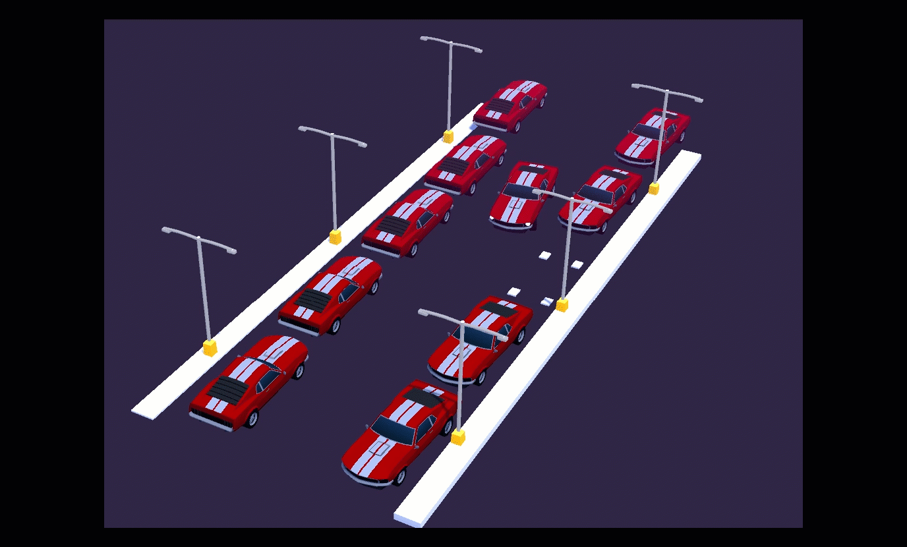

# 🚗 Self Parallel-Parking in Unity 
Using Genetic Evolutionary Algorithm for self parallel parking in Unity from scratch.

# The idea
1. Create movement to the car: engine & steering wheel
2. Give sensor that calculate distance near the car
   
   
4. Give Brain to the car that takes in the sensor values and outputs the engine & steering wheel strength
5. Run the Genetic Algorithm (GA) for training and save the best Genome
   
   
7. Paste the Genome into an empty agent for testing
   

## HyperParameters
- ⏰ Agent Life time
- 👾 Mutation probability, %
- 💪 Long-living champions, %
- 👩‍👨‍👧‍👦 Max Group size
- 📅 Max number of generations

# Genetic Algorithm (GA)
1. Initialization: Create diverse sets of genes representing 9 initial weights for engine and steering (Both in 10-bit structure: 1 sign bit, 4 exponent bits, and 5 mantissa bits).
2. Fitness Evaluation: After reaching the `Agent Life time`, stop the movement and calculate the `loss` (Distance to the target parking spot).
3. Selection: Sort the agent based on the loss and remove agents based on the `Long-living champions` (%). 
4. Crossover (Mating): For the remaining agent, combine the genomes of selected parent cars in a 50/50 manner, allowing for the exchange of genetic material. This aims to produce improved offspring by inheriting the best features from their parents.
5. Mutation: Introduce random mutations during mating, randomly flipping bits in the child genomes. This introduces variability, potentially leading to novel car behaviors.

Iteration: Repeat steps 2 to 5 until a stopping condition is met, such as reaching `Max number of generations` or achieving the desired proximity to the parking spot (e.g., within 1 meter). If the condition is met, stop; otherwise, continue iterating to refine the car's self-parking abilities.

# How to Run:
1. Download the repository
2. Open Scenes/Parallel Parking.unity scene
3. Set the simulation setting you desire and run it.
4. After training, Copy the best genome into AgentOptimal for testing.

Credit:
3D Model: https://assetstore.unity.com/packages/3d/vehicles/land/arcade-free-racing-car-161085#publisher
